# x402 Vending Machine

### Token Launchpad for Agent Economy

**Turn any x402 service into an investable primitive**

*Built by [Heurist](https://heurist.ai) on [x402](https://x402.org) • MIT Licensed*

[Website](https://vending-machine.heurist.xyz) • [x402scan Interface](https://www.x402scan.com/server/a973dd7f-e4e1-4fdc-a635-151103d27e12)

## Overview x402 Vending Machine

**x402 Vending Machine** transforms any x402 service into an **investable primitive**. It enables:

- **Token launches** with standardized economics
- **Capital raising** through x402 protocol
- **Community ownership** and upside participation
- **Trustless liquidity** provision

> **Lifecycle:** `Coin → Sell → Graduate → Trade`
>
> Every step is verifiable on-chain. Every launch follows identical rules. No special deals or insider allocations.

## Standardized Economics

Every launch follows identical tokenomics with no variable parameters or special deals.

### Token Distribution

**1 Billion Tokens (Fixed Supply)**
- **80%** (800M) → Public sale via x402
- **10%** (100M) → Liquidity pool (LP tokens burned at graduation)
- **8%** (80M) → Creator allocation
- **2%** (20M) → Platform fee

**Launch Sizes:**
| Size | Capital Raised | Initial FDV | Token Price |
|------|---------------|-------------|-------------|
| **Small (SM)** | 4,000 USDC | 5,000 USDC | 0.000005 USDC |
| **Large (LG)** | 40,000 USDC | 50,000 USDC | 0.00005 USDC |

### Launch Lifecycle

<b>Phase 1: Sale Period (14 Days)</b>

- Tokens launch via x402 protocol
- Anyone can purchase (humans or agents)
- Tokens mint immediately to buyer wallets
- Transfers are locked to prevent pre-market trading
- 14-day window to sell 800M tokens

<b>Phase 2: Graduation (Automatic)</b>

When 800M tokens are sold, the contract automatically executes:

1. Swaps 100% of raised USDC → HEU on Uniswap V3
2. Creates Token/HEU liquidity pair on Uniswap V2
3. Burns LP tokens permanently (eliminates rugpull risk)
4. Enables token transfers

> **No human intervention required.** The contract executes immutably and transparently.

<b>Phase 3: Refund (If Unsuccessful)</b>

If 800M tokens are not sold within 14 days:
- All buyers receive proportional USDC refunds
- Tokens are burned from user wallets
- No capital loss for participants

## Smart Contract Architecture

Three core contracts work together to enable trustless token launches:

<table>
<tr>
<td width="33%" valign="top">

**VendingMachine**
*Central Controller*

• Deploys tokens
• Tracks allocations
• Mints to buyers
• Triggers graduation
• Manages refunds

</td>
<td width="33%" valign="top">

**TreasuryVault**
*Payment Receiver*

• Receives USDC
• Swaps to HEU
• Creates liquidity
• Burns LP tokens
• Zero admin keys

</td>
<td width="33%" valign="top">

**X402Token**
*Tradeable Asset*

• ERC-20 token
• ERC-3009 (gasless)
• ERC-7572 (metadata)
• Transfer lock
• 1B fixed supply

</td>
</tr>
</table>

### Contract Interaction Flow

```mermaid
sequenceDiagram
    participant Creator
    participant Buyer
    participant VendingMachine
    participant TreasuryVault
    participant X402Token
    participant UniswapV3
    participant UniswapV2

    Note over Creator,X402Token: Phase 1: Launch & Sale
    Creator->>VendingMachine: coin(name, symbol)
    VendingMachine->>X402Token: deploy()
    Note over X402Token: Transfers locked<br/>Supply: 1B tokens

    Buyer->>TreasuryVault: x402 payment (USDC)
    TreasuryVault->>VendingMachine: handlePurchase()
    VendingMachine->>X402Token: mint(buyer, amount)
    X402Token-->>Buyer: tokens (non-transferable)

    Note over VendingMachine,UniswapV2: Phase 2: Graduation (Automatic)
    Note over VendingMachine: 800M tokens sold ✓
    VendingMachine->>TreasuryVault: graduate()
    TreasuryVault->>UniswapV3: swap USDC → HEU
    UniswapV3-->>TreasuryVault: HEU tokens
    TreasuryVault->>UniswapV2: addLiquidity(Token, HEU)
    UniswapV2-->>TreasuryVault: LP tokens
    TreasuryVault->>TreasuryVault: burn LP tokens 🔥
    VendingMachine->>X402Token: enableTransfers()
    Note over X402Token: Now tradeable on Uniswap
```

### VendingMachine.sol
**The Central Controller**

The main factory and orchestrator of the entire system. Manages launching, accounting, token minting, refunding, and graduation.

**Key Functions:**
- `coin()` - Deploy a new token with standardized parameters
- `handlePurchase()` - Process verified x402 payments and mint tokens
- `graduate()` - Execute USDC→HEU swap, create liquidity, enable transfers
- `refund()` - Return USDC to buyers if launch fails

**Features:**
- Owns the TreasuryVault that receives all USDC payments
- Each launch tracks its own allocation onchain - no interference between launches
- Operators (backend wallets) process transactions asynchronously
- Tokens are non-transferable until graduation
- **Automatic graduation** when 800M tokens are sold

### X402Token.sol
**The Tradeable Asset**

An enhanced [ERC-20](https://eips.ethereum.org/EIPS/eip-20) token optimized for agent commerce.

**Specifications:**
- **Supply:** 1 billion tokens (fixed)
- **[ERC-3009](https://eips.ethereum.org/EIPS/eip-3009):** Gasless transfers via cryptographic signatures
- **[ERC-7572](https://eips.ethereum.org/EIPS/eip-7572):** Customizable metadata (token icon, social links, descriptions)
- **Transfer Lock:** Disabled until graduation

**Use Case:**
Every token launched can serve as both:
1. An investable asset (tradeable on Uniswap V2 post-graduation)
2. A payment token in x402 flows

### TreasuryVault.sol
**The Payment Receiver**

A minimal, trustless vault that holds funds and executes swaps.

**Responsibilities:**
- Receives all USDC payments from x402 protocol (the `payTo` address)
- Executes USDC→HEU swaps on Uniswap V3
- Creates Token/HEU liquidity pairs on Uniswap V2
- Burns LP tokens at graduation

**Security:**
- Zero admin keys
- Only callable by VendingMachine
- Pure code execution, no human intervention possible

## Off-Chain Infrastructure

The off-chain infrastructure bridges x402 payments with on-chain contract execution through an API server and background processing system.

### API Endpoints

| Endpoint | Purpose |
|----------|---------|
| `/coin` | Deploy a new token launch |
| `/buy` / `/buy10x` | Purchase tokens via x402 |
| `/launches` | View all token launches |
| `/tokenDetails` | Get launch status and progress |

### Processing Flow

1. **Payment Reception** → x402 payment verified via Coinbase facilitator
2. **Job Queue** → Transactions enqueued for async processing
3. **Onchain Execution** → Operator wallets execute contract calls
4. **State Validation** → Always reads fresh onchain data to prevent race conditions

The system automatically triggers graduation when targets are reached and ensures no overselling through continuous validation.

## Contract Addresses

### Base Mainnet

<b>Core System Contracts</b>

| Contract | Address | Description |
|----------|---------|-------------|
| **VendingMachine** | [`0xca85edab3ede15059fdabf27d861a942196ccccf`](https://basescan.org/address/0xca85edab3ede15059fdabf27d861a942196ccccf) | Main controller and factory |
| **TreasuryVault** | [`0x7d9d1821d15B9e0b8Ab98A058361233E255E405D`](https://basescan.org/address/0x7d9d1821d15B9e0b8Ab98A058361233E255E405D) | Payment receiver and liquidity manager |

<b>Token Contracts</b>

| Token | Address | Decimals |
|-------|---------|----------|
| **USDC** | [`0x833589fCD6eDb6E08f4c7C32D4f71b54bdA02913`](https://basescan.org/token/0x833589fCD6eDb6E08f4c7C32D4f71b54bdA02913) | 6 |
| **HEU** | [`0xEF22cb48B8483dF6152e1423b19dF5553BbD818b`](https://basescan.org/token/0xEF22cb48B8483dF6152e1423b19dF5553BbD818b) | 18 |

<b>Uniswap Infrastructure</b>

| Protocol | Address | Purpose |
|----------|---------|---------|
| **Uniswap V3 Router** | [`0x2626664c2603336E57B271c5C0b26F421741e481`](https://basescan.org/address/0x2626664c2603336E57B271c5C0b26F421741e481) | USDC → HEU swaps |
| **Uniswap V2 Router** | [`0x4752ba5DBc23f44D87826276BF6Fd6b1C372aD24`](https://basescan.org/address/0x4752ba5DBc23f44D87826276BF6Fd6b1C372aD24) | Liquidity addition |
| **Uniswap V2 Factory** | [`0x8909Dc15e40173Ff4699343b6eB8132c65e18eC6`](https://basescan.org/address/0x8909Dc15e40173Ff4699343b6eB8132c65e18eC6) | Pair creation |

### Multi-Chain Deployment
VendingMachine and TreasuryVault contracts are deployed immutably on [Base](https://base.org), with planned expansion to:
- **BNB Chain** (Coming soon)
- **X Layer** (Coming soon)

## Vision: Sovereign Sub-Economies

The agent economy isn't one nation with one currency. It's **thousands of sovereign city-states**, each with its own economy, rules, and citizens.

### The Model

A trading collective operates its own financial system:

- Members hold tokens and govern decisions
- Internal transactions use the native currency
- External purchases require other tokens
- The collective operates as an economically sovereign zone

### Interoperability

These economies interoperate through shared protocols:

- Agents move freely between economies based on utility and price
- Capital flows to where value is created
- Similar to merchants trading between medieval city-states
- Open protocols enable seamless cross-economy commerce

### The Primitive

x402 Vending Machine builds these economies. Each token launched represents:

- Citizenship in an economic territory
- Coordination mechanism for agents
- Value capture for ecosystem participants
- Access to agentic value creation

### The Endgame

Not one global agent economy, but a Cambrian explosion of micro-economies:
- Each optimized for different purposes
- All interoperating through cryptographic protocols
- Capital and agents flowing to where they create most value
- A decentralized, permissionless economy at machine scale

## Open Source

All **[smart contracts](./contracts)** are open source and licensed under **[MIT License](https://opensource.org/licenses/MIT)**.

**Key Security Features:**
- ✅ **Immutable Contracts** - No upgrade keys or admin functions
- ✅ **Burned LP Tokens** - Automatic burn at graduation (rugpulls impossible)
- ✅ **Zero Admin Keys** - TreasuryVault has no privileged access
- ✅ **Onchain Verification** - All state transitions emit events 

## Getting Started

### For Service Creators
Launch a token for your x402 service:

1. Visit the x402scan api explorer at **[x402scan](https://www.x402scan.com/server/a973dd7f-e4e1-4fdc-a635-151103d27e12)**
2. Choose your launch size (Small: 4K USDC / Large: 40K USDC)
3. Configure token name, symbol, and metadata
4. Deploy via x402 protocol
5. Share with your community and start raising capital

### For Investors & Users
Discover and invest in agent services:

1. Interact with launch api endpoints on **[x402scan](https://www.x402scan.com/server/a973dd7f-e4e1-4fdc-a635-151103d27e12)**
2. Research service metrics, usage data, and revenue
3. Purchase tokens via x402 protocol (pay USDC, receive tokens instantly)
4. Hold during the 14-day sale period
5. Trade on Uniswap V2 after graduation

### For Developers
Integrate the Vending Machine into your applications:

- **API Endpoints:** `/coin`, `/buy`, `/buy10x`, `/launches`, `/tokenDetails`
- **Smart Contracts:** `VendingMachine.sol`, `TreasuryVault.sol`, `X402Token.sol` - See **[contracts](./contracts)**

## Additional Resources

<table>
<tr>
<td valign="top">

**Platform**

• **[Website](https://vending-machine.heurist.xyz)**
  View the user interface guide (Frontend Terminal Coming Soon)

• **[x402scan](https://www.x402scan.com/server/a973dd7f-e4e1-4fdc-a635-151103d27e12)**
  Interact with the Vending Machine via API endpoints

</td>
<td valign="top">

**Documentation**

• **[x402 Documentation](https://x402.gitbook.io/x402)**
  Learn about the payment protocol

• **[Smart Contracts](./contracts)**
  Browse open source contracts

</td>
</tr>
</table>

## Summary

The agent economy generates real revenue through x402. The missing piece was value capture - converting usage into ownership, enabling investment, and allowing agents to raise capital for growth.

x402 Vending Machine provides that primitive. It's infrastructure for sovereign sub-economies where agents coordinate, transact, and build together.

Thousands of these economies will emerge, each optimized for different purposes, all interoperating through cryptographic protocols.

## Contact & Support

**Built by [Heurist](https://heurist.ai)**

- 🌐 Website: [heurist.ai](https://heurist.ai)
- 🐦 Twitter: [@heurist_ai](https://twitter.com/heurist_ai)
- 💬 Discord: [Join our community](https://discord.gg/heuristai)
- 📧 Email: team@heurist.xyz

For technical support, issues, or feature requests, please open an issue in this repository.
